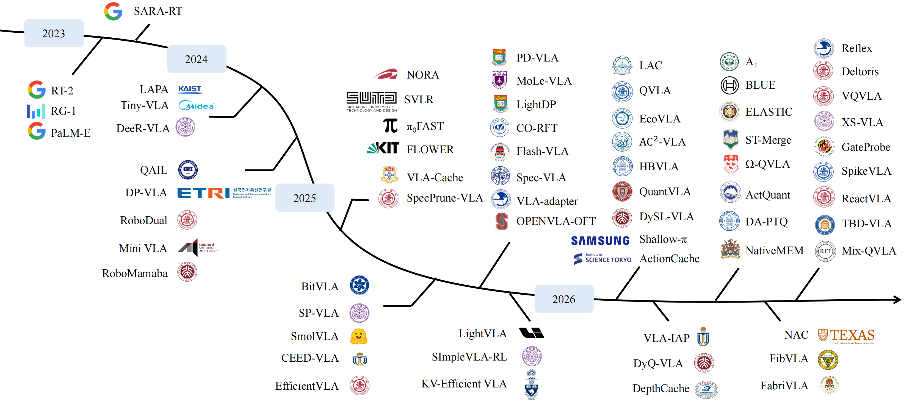

# Compression for Vision-Language-Action Models

I currently focus on compression methods for Vision-Language-Action models, including
- [Surveys](#surveys)
- [Visual Input Compression](#visual-input-compression)
- [Backbone Compression](#backbone-compression)
- [Action Generation Compression](#action-generation-compression)
- [Hybrid / System-level Compression](#hybrid--system-level-compression)

> [!IMPORTANT]
> **Last Update: 2026/08/07**

<a name="Surveys" />

## Surveys

### Efficient / Resource-Constrained VLA Surveys

- [2026] A survey of vision-language-action (VLA) models for resource-constrained embodied intelligence, Acta Automatica Sinica
- [2025.10] Efficient vision-language-action models for embodied manipulation: A systematic survey, arXiv [[Paper](https://arxiv.org/abs/2510.17111)]
- [2025.10] A survey on efficient vision-language-action models, arXiv [[Paper](https://arxiv.org/abs/2510.24795)]

### General VLA Surveys and Evaluation Resources

- [2026.04] Vision-Language-Action in Robotics: A Survey of Datasets, Benchmarks, and Data Engines, arXiv [[Paper](https://arxiv.org/abs/2604.23001)]
- [2026] Survey of Vision-Language-Action Models for Embodied Manipulation, Acta Automatica Sinica [[Paper](https://doi.org/10.16383/j.aas.c250689)]
- [2025] Vision-Language-Action Models: From the Early Foundations to the State-of-the-Art, Acta Automatica Sinica [[Paper](https://doi.org/10.16383/j.aas.c250417)]
- [2025] Vision-language-action models for robotics: A review towards real-world applications, IEEE Access

## Visual Input Compression

### Visual Token Pruning

- [2026.03] VLA-IAP: Training-Free Visual Token Pruning via Interaction Alignment for Vision-Language-Action Models, arXiv [[Paper](https://arxiv.org/abs/2603.22991)]
- [2025.11] VLA-Pruner: Temporal-Aware Dual-Level Visual Token Pruning for Efficient Vision-Language-Action Inference, arXiv [[Paper](https://arxiv.org/abs/2511.16449)] [[Code](https://github.com/MINT-SJTU/VLA-Pruner)]
- [2025.09] Action-aware Dynamic Pruning for Efficient Vision-Language-Action Manipulation, arXiv [[Paper](https://arxiv.org/abs/2509.22093)]
- [2025.09] SpecPrune-VLA: Accelerating Vision-Language-Action Models via Action-Aware Self-Speculative Pruning, arXiv [[Paper](https://arxiv.org/abs/2509.05614)]
- [2025.08] CogVLA: Cognition-Aligned Vision-Language-Action Model via Instruction-Driven Routing & Sparsification, NeurIPS 2025 [[Paper](https://arxiv.org/abs/2508.21046)]

### Visual Token Merging

- [2026.07] NativeMEM: Native Memory Compression for Long-Horizon Robotic Manipulation, arXiv [[Paper](https://arxiv.org/abs/2607.06678)]
- [2026.06] Fast Enough to Act: Spatio-Temporal Visual Token Merging for Low-Latency Robotic VLMs and VLAs, arXiv [[Paper](https://arxiv.org/abs/2606.29350)]
- [2026.03] DepthCache: Depth-Guided Training-Free Visual Token Merging for Vision-Language-Action Model Inference, arXiv [[Paper](https://arxiv.org/abs/2603.10469)]
- [2026] SemanticVLA: Semantic-Aligned Sparsification and Enhancement for Efficient Robotic Manipulation, AAAI 2026
- [2025.12] Token Expand-Merge: Training-Free Token Compression for Vision-Language-Action Models, arXiv [[Paper](https://arxiv.org/abs/2512.09927)]
- [2025.11] COMPRESSOR-VLA: Instruction-Guided Visual Token Compression for Efficient Robotic Manipulation, arXiv [[Paper](https://arxiv.org/abs/2511.18950)]
- [2025] Focusing on What Matters: Object-Agent-centric Tokenization for Vision Language Action Models, CoRL 2025

### Visual Token Caching and Reuse

- [2026.02] Learning to Accelerate Vision-Language-Action Models through Adaptive Visual Token Caching, arXiv [[Paper](https://arxiv.org/abs/2602.00686)]
- [2026] TTF-VLA: Temporal Token Fusion via Pixel-Attention Integration for Vision-Language-Action Models, AAAI 2026 [[Code](https://github.com/PKU-XLab/TTF-VLA)]
- [2025.09] RetoVLA: Reusing Register Tokens for Spatial Reasoning in Vision-Language-Action Models, ICRA 2026 [[Paper](https://arxiv.org/abs/2509.21243)]
- [2025.02] VLA-Cache: Efficient Vision-Language-Action Manipulation via Adaptive Token Caching, NeurIPS 2025 [[Paper](https://arxiv.org/abs/2502.02175)] [[Project](https://vla-cache.github.io)]

## Backbone Compression

### Weight Compression

- [2026.07] A Motion-Aware Vector Quantization Framework with Centroid Reuse for Efficient VLA Inference, arXiv [[Paper](https://arxiv.org/abs/2607.24148)]
- [2026.03] DyQ-VLA: Temporal-Dynamic-Aware Quantization for Embodied Vision-Language-Action Models, arXiv [[Paper](https://arxiv.org/abs/2603.07904)]
- [2025.10] Don't Run with Scissors: Pruning Breaks VLA Models but They Can Be Recovered, arXiv [[Paper](https://arxiv.org/abs/2510.08464)]
- [2025.06] RLRC: Reinforcement Learning-based Recovery for Compressed Vision-Language-Action Models, arXiv [[Paper](https://arxiv.org/abs/2506.17639)]

### Layer Compression and Dynamic Inference

- [2026.06] Finetuning Vision-Language-Action Models Requires Fewer Layers Than You Think, arXiv [[Paper](https://arxiv.org/abs/2606.20246)]
- [2026.06] Drop-Then-Recovery: How Redundant Are Vision-Language-Action Models?, arXiv [[Paper](https://arxiv.org/abs/2606.27755)]
- [2026.06] BLUE: Toward Better Language Use in Efficient Vision-Language-Action Models for Autonomous Driving, arXiv [[Paper](https://arxiv.org/abs/2606.08684)]
- [2026.02] DySL-VLA: Efficient Vision-Language-Action Model Inference via Dynamic-Static Layer-Skipping for Robot Manipulation, arXiv [[Paper](https://arxiv.org/abs/2602.22896)]
- [2025.11] ActDistill: General Action-Guided Self-Derived Distillation for Efficient Vision-Language-Action Models, arXiv [[Paper](https://arxiv.org/abs/2511.18082)]
- [2025.03] MoLe-VLA: Dynamic Layer-skipping Vision Language Action Model via Mixture-of-Layers for Efficient Robot Manipulation, AAAI 2026 [[Paper](https://arxiv.org/abs/2503.20384)]
- [2024.11] DeeR-VLA: Dynamic Inference of Multimodal Large Language Models for Efficient Robot Execution, NeurIPS 2024 [[Paper](https://arxiv.org/abs/2411.02359)] [[Code](https://github.com/yueyang130/DeeR-VLA)]

### KV Cache Compression and Reuse

- [2025.09] KV-Efficient VLA: A Method to Speed up Vision Language Models with RNN-Gated Chunked KV Cache, arXiv [[Paper](https://arxiv.org/abs/2509.21354)]

## Action Generation Compression

### Action Token Compression

- [2026.06] NAC: Neural Action Codec for Vision-Language-Action Models, arXiv [[Paper](https://arxiv.org/abs/2606.21372)]
- [2025.01] FAST: Efficient Action Tokenization for Vision-Language-Action Models, arXiv [[Paper](https://arxiv.org/abs/2501.09747)]

### Iterative / Parallel Action Generation

- [2026.06] ELASTIC: Efficiently Learning to Adaptively Scale Test-Time Compute for Generative Control Policies, arXiv [[Paper](https://arxiv.org/abs/2606.31132)]
- [2026.06] TBD-VLA: Temporal Block Diffusion Vision Language Action Model, arXiv [[Paper](https://arxiv.org/abs/2606.07895)]
- [2025.06] CEED-VLA: Consistency Vision-Language-Action Model with Early-Exit Decoding, arXiv [[Paper](https://arxiv.org/abs/2506.13725)]

### Reasoning and Action Reuse

- [2026.07] ActionCache: Training-Free Acceleration for Vision-Language-Action Models with Action Caching and Refinement, arXiv [[Paper](https://arxiv.org/abs/2607.06370)]
- [2025.06] Fast ECoT: Efficient Embodied Chain-of-Thought via Thoughts Reuse, arXiv [[Paper](https://arxiv.org/abs/2506.07639)]

## Hybrid / System-level Compression

### Joint Compression

- [2026.07] Reflex: Real-Time VLA Control through Streaming Inference, arXiv [[Paper](https://arxiv.org/abs/2607.14695)]
- [2026.06] Mix-QVLA: Task-Evidence-Aware Mixed-Precision Quantization of Vision-Language-Action Models, arXiv [[Paper](https://arxiv.org/abs/2606.19565)]
- [2026.05] Ω-QVLA: Robust Quantization for Vision-Language-Action Models via Composite Rotation and Per-step Scaling, arXiv [[Paper](https://arxiv.org/abs/2605.28803)]
- [2026.04] DA-PTQ: Drift-Aware Post-Training Quantization for Efficient Vision-Language-Action Models, arXiv [[Paper](https://arxiv.org/abs/2604.11572)]
- [2026.02] QuantVLA: Scale-calibrated post-training quantization for vision-language-action models, CVPR 2026 [[Paper](https://arxiv.org/abs/2602.20309)] [[Project](https://quantvla.github.io)]
- [2026.02] HBVLA: Pushing 1-Bit Post-Training Quantization for Vision-Language-Action Models, arXiv [[Paper](https://arxiv.org/abs/2602.13710)]
- [2026.02] QVLA: Not All Channels Are Equal in Vision-Language-Action Model's Quantization, ICLR 2026 [[Paper](https://arxiv.org/abs/2602.03782)] [[Code](https://github.com/AutoLab-SAI-SJTU/QVLA)]
- [2025.09] SQAP-VLA: A Synergistic Quantization-Aware Pruning Framework for High-Performance Vision-Language-Action Models, arXiv [[Paper](https://arxiv.org/abs/2509.09090)]
- [2025.06] EfficientVLA: Training-Free Acceleration and Compression for Vision-Language-Action Models, NeurIPS 2025 [[Paper](https://arxiv.org/abs/2506.10100)] [[Code](https://github.com/YantaiYang-05/EfficientVLA)]

### Adaptive Scheduling

- [2026.04] A1: A Fully Transparent Open-Source, Adaptive and Efficient Truncated Vision-Language-Action Model, arXiv [[Paper](https://arxiv.org/abs/2604.05672)]
- [2026.02] EcoVLA: Environment-Aware Adaptive Pruning with Interleaved Inference Orchestration for Vision-Language-Action Models, arXiv [[Paper](https://arxiv.org/abs/2602.00780)]
- [2026.01] AC²-VLA: Action-Context-Aware Adaptive Computation in Vision-Language-Action Models for Efficient Robotic Manipulation, arXiv [[Paper](https://arxiv.org/abs/2601.19634)]
- [2025.08] Leveraging OS-Level Primitives for Robotic Action Management, arXiv [[Paper](https://arxiv.org/abs/2508.10259)]
- [2025.06] SP-VLA: A Joint Model Scheduling and Token Pruning Approach for VLA Model Acceleration, arXiv [[Paper](https://arxiv.org/abs/2506.12723)]
- [2025.05] Think Twice, Act Once: Token-Aware Compression and Action Reuse for Efficient Inference in Vision-Language-Action Models, arXiv [[Paper](https://arxiv.org/abs/2505.21200)]

### Lightweight Architecture

- [2026.07] FibVLA: An Efficient Temporal Vision-Language-Action Model with Fibonacci Sampling, arXiv [[Paper](https://arxiv.org/abs/2607.29596)]
- [2026.07] FabriVLA: A Lightweight Vision-Language-Action Model for Precise Multi-Task Manipulation, arXiv [[Paper](https://arxiv.org/abs/2607.08575)]
- [2026.07] Teaching Tiny VLA Models Where to Look and How to Move, arXiv [[Paper](https://arxiv.org/abs/2607.04171)]
- [2026.06] SpikeVLA: Vision-Language-Action Models with Spiking Neural Networks, arXiv [[Paper](https://arxiv.org/abs/2606.27807)]
- [2026.06] ReactVLA: Fast and Lightweight Reactive Robot Manipulation via Improved Mean Flow Action Generation, arXiv [[Paper](https://arxiv.org/abs/2606.14255)]
- [2026.01] Shallow-π: Knowledge Distillation for Flow-based VLAs, arXiv [[Paper](https://arxiv.org/abs/2601.20262)]
- [2025.09] dVLA: Diffusion Vision-Language-Action Model with Multimodal Chain-of-Thought, arXiv [[Paper](https://arxiv.org/abs/2509.25681)]
- [2025.09] FLOWER: Democratizing Generalist Robot Policies with Efficient Vision-Language-Action Flow Policies, arXiv [[Paper](https://arxiv.org/abs/2509.04996)]
- [2025.06] BitVLA: 1-bit Vision-Language-Action Models for Robotics Manipulation, arXiv [[Paper](https://arxiv.org/abs/2506.07530)]
- [2025.06] SmolVLA: A Vision-Language-Action Model for Affordable and Efficient Robotics, arXiv [[Paper](https://arxiv.org/abs/2506.01844)]

